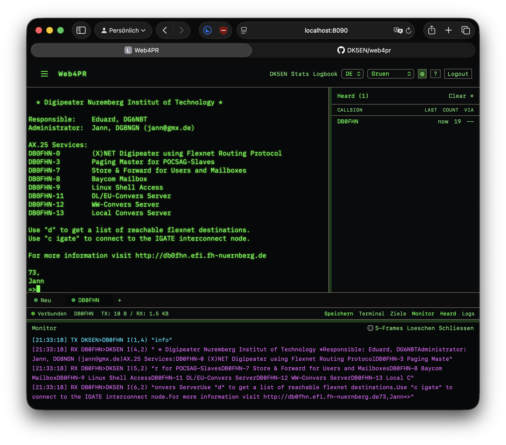

# Web4PR

Web-based Packet Radio client for HAMnet — browser terminal for AX.25 connections, no TNC required.



A valid amateur radio license is required to use this software on air.

---

## Install

Requires Debian Bookworm (12) or Trixie (13) — including Raspberry Pi OS (64-bit).

```bash
curl -fsSL https://raw.githubusercontent.com/DK5EN/web4pr/main/install.sh | sudo bash
```

The installer will:
- Install Python 3.12 and [uv](https://docs.astral.sh/uv/) if not already present
- Download and install the latest Web4PR release
- Ask for your callsign and an admin password
- Set up a systemd service that starts automatically on boot

After install, open `http://<your-host>:8080` in a browser.

---

## Upgrade

Re-run the installer — it detects an existing installation and preserves your configuration:

```bash
curl -fsSL https://raw.githubusercontent.com/DK5EN/web4pr/main/install.sh | sudo bash
```

Or to install a specific version:

```bash
curl -fsSL https://raw.githubusercontent.com/DK5EN/web4pr/main/install.sh | sudo bash -s v0.2.0
```

---

## Service management

```bash
systemctl status  web4pr     # status
systemctl restart web4pr     # restart
journalctl -u web4pr -f      # live logs
```

---

## Requirements

- Debian Bookworm or Trixie (arm64, armhf, amd64)
- HAMnet access — VPN or direct connection to 44.0.0.0/8
- Port 8080 reachable in your local network

---

## Source

Source code and development tools: [DK5EN/web4pr-src](https://github.com/DK5EN/web4pr-src) (private)

---

73 de DK5EN
